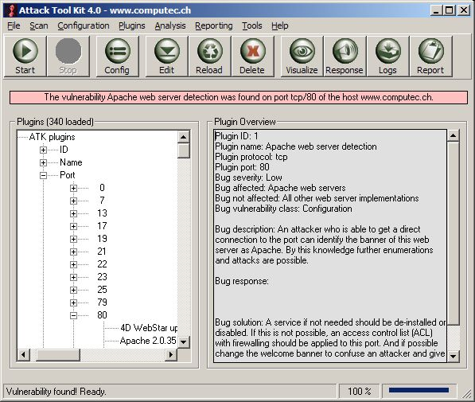



## Attack Tool Kit 4\.0

### Description

The Attack Tool Kit (ATK) is an open-source security scanner and exploiting framework for Microsoft Windows.

In ATK 4.the most improvements and enhancements has been invested in the reporting engine. The generation of html, text and Nessus nsr reports is now possible. Furthermore more than 340 ATK plugins are available and the Nessus NASL plugin handling has been re-introduced.
 
### More Info
 

             |
---                |---
**Submitted On**   |2005-01-11 19:38:22
**By**             |[Marc Ruef](https://github.com/Planet-Source-Code/PSCIndex/blob/master/ByAuthor/marc-ruef.md)
**Level**          |Advanced
**User Rating**    |5.0 (30 globes from 6 users)
**Compatibility**  |VB 6\.0
**Category**       |[Internet/ HTML](https://github.com/Planet-Source-Code/PSCIndex/blob/master/ByCategory/internet-html__1-34.md)
**World**          |[Visual Basic](https://github.com/Planet-Source-Code/PSCIndex/blob/master/ByWorld/visual-basic.md)
**Archive File**   |[Attack\_Too1839421132005\.zip](https://github.com/Planet-Source-Code/marc-ruef-attack-tool-kit-4-0__1-58262/archive/master.zip)

